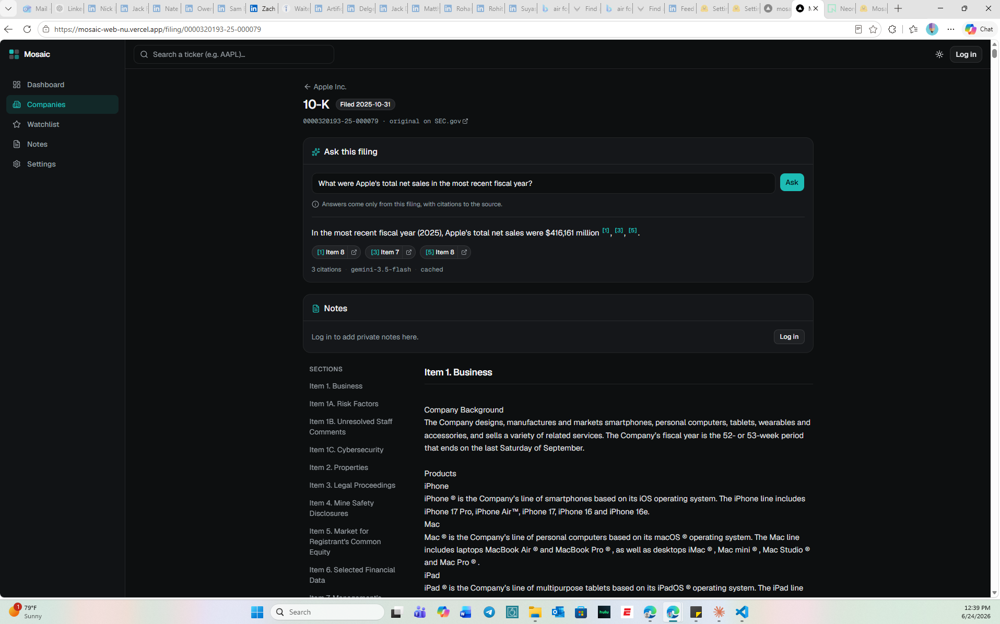
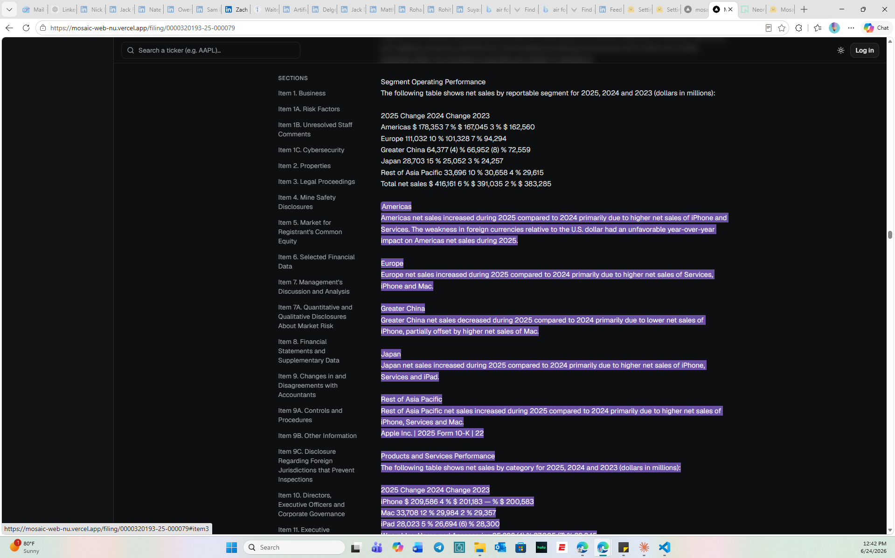
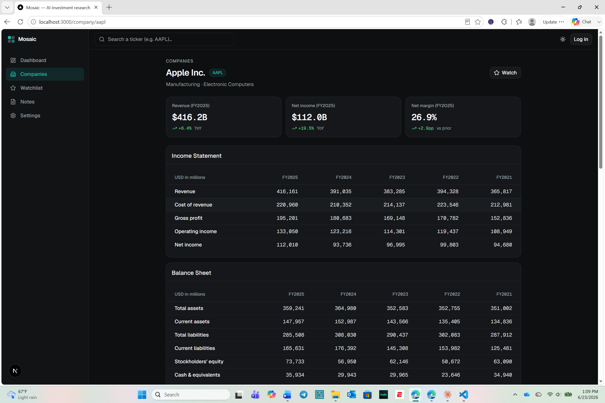
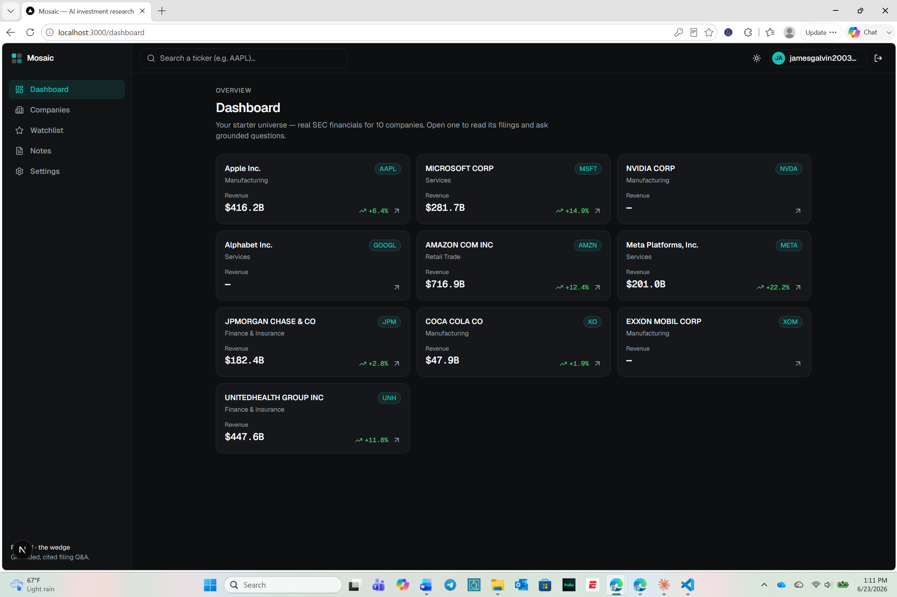

# Mosaic

I built Mosaic because I wanted to actually understand the companies I invest in — not just check a stock price, but read the filings, track the numbers, and form a real view. The problem is that doing it properly is slow and the tools available are either too shallow or way too expensive.

So I built something for myself: a tool that reads 10-Ks for me, answers questions about them in plain English, and shows its work. Every AI-generated claim links back to the exact paragraph in the source document. If the answer isn't in the filing, it says so.

This is a personal learning project. I wanted to get better at financial research, and building the tool seemed like the best way to understand how it all works.

**Live demo:** [mosaic-web-nu.vercel.app](https://mosaic-web-nu.vercel.app) — browse a company, open a 10-K, and try "Ask this filing." Runs entirely on free infrastructure.


*Ask a 10-K a question in plain English — every claim is footnoted to the exact source.*


*Click a footnote and it jumps to and highlights the exact paragraph the answer came from — nothing is taken on faith.*


*Five years of SEC financials for any company, pulled directly from EDGAR.*


*Watchlists and notes that persist across sessions — research stays with you.*

> *Mosaic theory* is how analysts build a legitimate investment view by assembling many individually-public pieces of information. That's what this does.

---

## What it does

You type a ticker. You get:

- **A company overview** — multi-year income statement, balance sheet, and cash flow pulled directly from SEC EDGAR via XBRL
- **A filing reader** — browse 10-Ks section by section (Risk Factors, MD&A, etc.) with a navigable outline
- **"Ask this filing"** — ask a question in plain English, get an answer grounded entirely in that filing's text, with footnotes that link to the exact source paragraph. If the answer isn't in the document, it says so rather than guessing.
- **A personal research layer** — watchlists and notes per company or filing, saved across sessions

---

## Why I built it

I got interested in learning how to research companies the way analysts actually do it — reading 10-Ks, understanding risk factors, tracking how the numbers change year over year. The free tools (Yahoo Finance, generic chatbots) are too shallow, and the professional tools (Bloomberg, FactSet) cost thousands a year.

AI tools like ChatGPT are useful for a lot of things, but you can't trust them with financial numbers — they'll confidently make something up. I wanted something that was honest about what it knew and what it didn't, and that would help me build real knowledge over time rather than just getting a quick answer I couldn't verify.

Building it also taught me a lot about the SEC data ecosystem, how RAG systems actually work under the hood, and what it takes to make an AI feature you can actually trust.

---

## Engineering highlights

A few things worth calling out for anyone looking at the technical side:

- **DB-enforced Postgres RLS.** User data (watchlists, notes) is protected by real Postgres Row-Level Security at the database layer — not application-level checks. The API connects as a non-superuser role so RLS is always enforced. During development the security test suite caught a superuser bypass that would have silently skipped RLS — that's now closed.
- **Runtime numbers guard.** Every AI answer is cross-checked against the source text it was generated from. Any figure in the response that doesn't appear verbatim in the retrieved passages is flagged before it reaches the reader, so fabricated numbers don't slip through silently.
- **RRF hybrid retrieval.** The "Ask this filing" feature fuses pgvector semantic search with Postgres full-text search using Reciprocal Rank Fusion, section-filtered per company and filing. Recall@8 = 1.00 on a 13-question golden set across 2 companies — honest baseline, more coverage planned.

---

## Tech stack

| Layer | Choice | Notes |
|---|---|---|
| Frontend | Next.js (App Router) + TypeScript + Tailwind | Server Components for data-heavy pages |
| Backend | Python + FastAPI | SEC ingestion, XBRL parsing, RAG orchestration |
| Database | Postgres + pgvector | Relational + vector + full-text in one DB |
| Auth | Custom — argon2 + JWT httpOnly cookies | With DB-enforced Postgres RLS |
| LLM | Gemini Flash (free tier, swappable) | Grounded Q&A — model is abstracted behind an interface |
| Embeddings | Local `bge-small` | Runs at $0, no rate limits during bulk ingestion |
| Hosting | Vercel (web) · Hugging Face Spaces (API) · Neon (Postgres) | All free tiers — the live demo runs at ~$0/mo |

---

## Running locally

Full local stack: real SEC financials, a filing reader, and the "Ask this filing" RAG demo — **browser → FastAPI → Postgres (pgvector) → browser**.

**Prerequisites:** Docker Desktop, Node 20+, Python 3.11+.

```bash
# 0. Env — copy the examples (real .env files stay gitignored)
cp .env.example .env
cp apps/web/.env.local.example apps/web/.env.local

# 1. Database
docker compose up -d
docker compose ps                             # STATUS should show "healthy"

# 2. Backend
cd services/api
py -m venv .venv                              # Windows; use python3 on macOS/Linux
.venv/Scripts/activate                        # macOS/Linux: source .venv/bin/activate
pip install torch --index-url https://download.pytorch.org/whl/cpu   # CPU-only, install first
pip install -r requirements.txt
alembic upgrade head                          # creates schema + mosaic_app role (M0–M4)

# 2a. Ingest SEC data for the 10 starter companies
python -m app.ingest.run                      # financials
python -m app.ingest.documents                # filing text + section segmentation
python -m app.ingest.chunk                    # section-aware retrieval chunks
python -m app.ingest.embed                    # bge embeddings -> pgvector
pytest                                        # runs the full test suite

uvicorn app.main:app --reload --port 8000

# 3. Frontend — new terminal, from repo root
npm install
npm run dev:web                               # http://localhost:3000
```

**For "Ask this filing":** add a free `GEMINI_API_KEY` to `.env` (get one at [aistudio.google.com/apikey](https://aistudio.google.com/apikey)). Without a key, set `LLM_PROVIDER=mock` to run the full pipeline offline.

---

## Repo structure

```
mosaic/
  apps/web/          # Next.js frontend
  services/api/      # FastAPI backend — ingestion, RAG, auth
  packages/shared/   # shared types
  docs/              # roadmap, decisions log, worklog, status
  .env.example       # all env vars documented (no secrets)
```

---

## Status

Phase 1 complete (M0–M4) — and **live**: deployed at [mosaic-web-nu.vercel.app](https://mosaic-web-nu.vercel.app) on free infrastructure (Vercel + Hugging Face Spaces + Neon). Next up (M6): widening the company universe and expanding the evaluation set. See [docs/ROADMAP.md](docs/ROADMAP.md).

---

*Research tool, not investment advice.*
